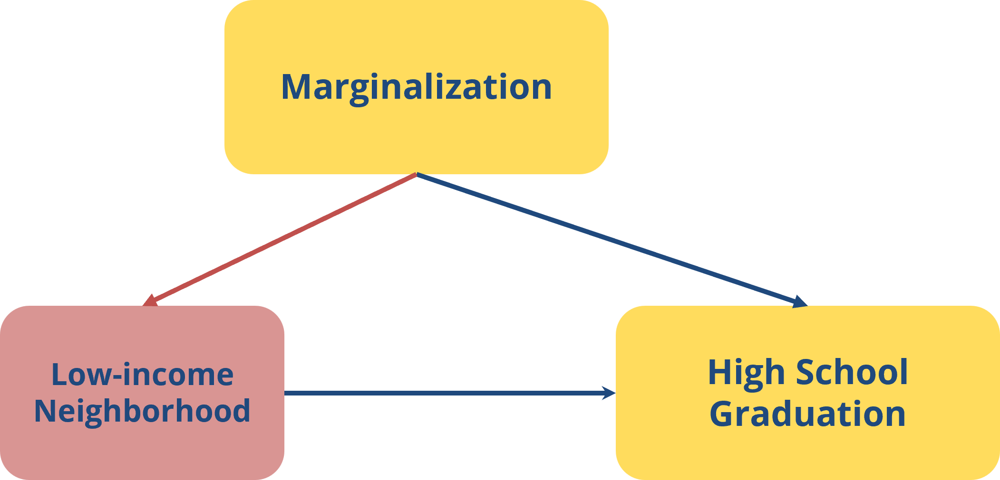
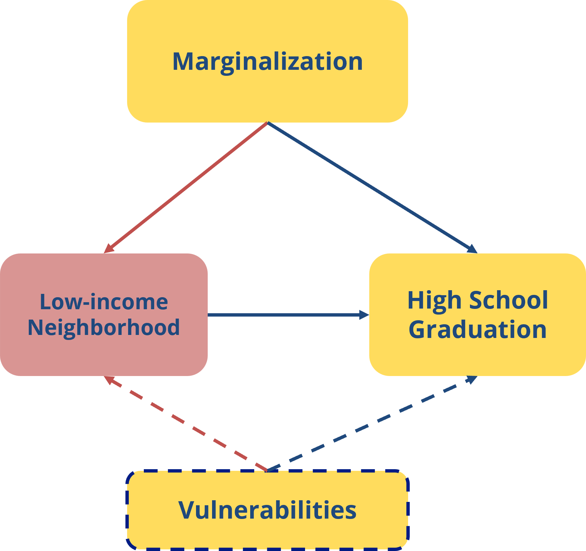
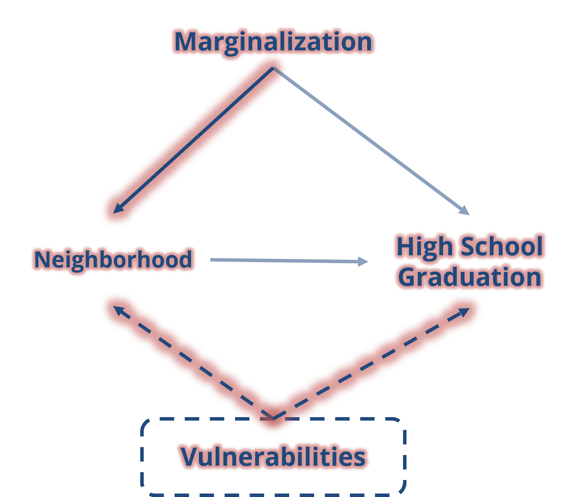

```{r setup, include=TRUE, message = FALSE, warning = FALSE, echo = FALSE}
knitr::opts_chunk$set(echo = TRUE)
#install.packages("DiagrammeR")
#if (!requireNamespace("broom", quietly = TRUE)) install.packages("broom")

library(DiagrammeR)
library(corrplot)
library(ggplot2)
library(dplyr)
library(dagitty)
library(ggdag)
library(stargazer)
library(ggrepel)
library(tidyverse)
library(broom)
library(reactable)
# library(widgetframe)
library(patchwork)
library(knitr)
```

```{css, echo=FALSE}
.navbar-default {
    background-color: #123271;
    border-color: #123271;
}

```

*(note, the R code used to generate this page can be downloaded [here](https://github.com/PovertyCenterCLE/FAIR2-PIT-UN/blob/main/Collider-bias.Rmd))*

We're interested in estimating the impact of discrimination (referred to as __marginalized__ or __marginalization__ going forward) on educational outcomes (we could look at any number of different education-related outcomes; today, we'll focus on __high school graduation__ in a city where __lower-income neighborhoods__ carry a higher risk of exposure to environmental hazards than higher-income neighborhoods. We'll focus specifically on the risk of exposure to lead, a toxin associated with cognitive and behavioral impairments, via chipped paint and lead-contaminated dust in older homes that may not have been properly maintained over the years.

We start by sketching a simple graphical model (a Directed Acyclic Graph or DAG) representing a hypothesized explanation of the ways in which __marginalization__ impacts __high school graduation__. Each variable in the DAG is represented by a node, while an edge or arrow between two nodes indicates a causal relationship in the direction of the arrow.

This model proposes two pathways through which __marginalization__ can shape __high school graduation__ 

* First, there is the direct pathway from __marginalization__ to __high school graduation__, 
* There is also an indirect pathway from *marginalization* to __high school graduation__, via __low-income neighborhood__. 

<br>


```{r collider bias DAG1, echo=FALSE, message=FALSE, warning=FALSE, fig.align="center", out.width="80%", out.height="80%"}





```

<br>

_Questions:_ 

1. Can you identify the direct and indirect pathways connecting __marginalization__ to __high school graduation__?

2. In addition to the direct & indirect pathways connecting __marginalization__ to __high school graduation__, there is one more causal pathway shown in this model. What is it? (i.e., *'X has a direct/indirect impact Y'*)

3. Can you think of a plausible reason (or reasons) for the hypothesized relationships between __marginalization__, __low-income neighborhood__, and __high school graduation__ that are shown in the DAG below? 

4. We know that not everyone experiences identical educational outcomes. Do you think this model does a good job of explaining why different people have different educational experiences (whether __high school graduation__ or educational outcomes more broadly)?


<br>

A more realistic DAG recognizes that factors _other than_ discrimination may lead to living in low-income neighborhoods. We'll refer to these factors as vulnerabilities (**V**).

What are some possible examples of __V__?

Once included as a variable in the model, we notice that while **V** does influence __low-income neighborhood__, it doesn't _only_ influence __low-income neighborhood__. It may _also_ influence __high school graduation__; to reflect this, we connect these variables with a causal edge. These Vulnerabilities are often difficult to observe, and thus difficult to identify in data, which we note using a dotted contour.  

The updated DAG looks like this:

<br>


```{r collider bias DAG2, echo=FALSE, message=FALSE, warning=FALSE, fig.align="center", out.width="80%", out.height="80%"}





```


<br>

Now, let's say our data was restricted to a school district where the majority of students face poverty. In other words, if, in our data, __low-income neighborhood__ is a binary variable where 1 == "low-income neighborhood" and 0 == "higher-income neighborhood", __low-income neighborhood__ is fixed at 1 (and no longer a variable, as it doesn't vary).

In this scenario, we are "selecting" on __low-income neighborhood__ (a collider), which opens up a non-causal pathway between __marginalization__ and __high school graduation__. 


The updated DAG looks like this:
<br>
```{r collider bias DAG3, echo=FALSE, message=FALSE, warning=FALSE, fig.align="center", out.width="80%", out.height="80%"}





```

<br>

How does selection on a collider bias our estimates on the causal effect of discrimination on high school graduation?


To explore this question, we will simulate data that mirrors the relationships specified in our DAG. The data simulation also needs to make assumptions about the statistical characteristics of the data such as distributional forms and parameters. In reality, we would work with real data, make distributional assumption and estimate parameters under those assumptions. However, simulated data works well to illustrate collider bias as we can see how the "real" (simulated) parameters compare to those estimated when bias is present. 

<br>

```{r Simulate data, echo=TRUE}

set.seed(123)


tb <- tibble(
  Marginalization = sample(c(0,1), size = 100000, replace = TRUE, prob = c(.65, .35)), 
  Vulnerabilities = rnorm(100000), 
    Poor_Nbhd = ifelse(
    (Vulnerabilities > 1.5   & Marginalization == 0) |
    (Vulnerabilities > 0.842 & Marginalization == 1), 1, 0), 
  HSG_01  = plogis(1.99 - Marginalization - Vulnerabilities - 0.5 * Poor_Nbhd + rnorm(100000, mean = 0, sd = 1))

  )


```

<br>

### Simulated data descriptive statistics{.tabset}

Let's examine the data we just created. What do you notice when comparing: 

  * all students vs. 
  * those living in low-income neighborhood (Poor_Nbhd == 1) vs. 
  * those living in non-low-income neighborhoods (Poor_Nbhd == 0)?

#### Full data

In this table, the mean values for __Marginalization__ and __Poor_Nbhd__ can be interpreted as 'the probability that a student belongs to a marginalized group' and 'the probability that a student lives in a low-income neighborhood', respectively.

These probability statements can also be written as: 

_P(Marginalization)_ and

_P(Poor_Nbhd)_

```{r echo=FALSE, message=FALSE, warning=FALSE}

tb %>% 
  mutate(Poor_Nbhd = as.numeric(Poor_Nbhd) - 1) %>% 
  summarise(across(c(Marginalization, Vulnerabilities, Poor_Nbhd, HSG_01), 
                   list(a = n_distinct, b = mean, c = min, d = max))) %>% 
  t() %>% 
  as.data.frame() %>% 
  rownames_to_column() %>% 
  mutate(
    var = str_sub(rowname, 1, -3), 
    stat = str_sub(rowname, -1)
  ) %>% 
  select(-rowname) %>% 
  mutate(
    stat = case_when(
      stat == "a" ~ "n_distinct", 
      stat == "b" ~ "mean", 
      stat == "c" ~ "min", 
      stat == "d" ~ "max"
    )
  ) %>% 
  pivot_wider(names_from = stat, values_from = V1) %>% 
  mutate(across(c(mean, min, max), ~round(., 5))) #%>% 
  # reactable()

```

#### Poor_Nbhd == 1

If we look only at the subset of students living in a _low-income neighborhood_, the mean value of __Marginalization__ can be interpreted as 'the probability that a student belongs to a marginalized group, given that they live in a low-income neighborhood', or

_P(Marginalization|Poor_Nbhd == 1)_

```{r echo=FALSE, message=FALSE, warning=FALSE}
tb %>% 
  filter(Poor_Nbhd == 1) %>% 
  summarise(across(c(Marginalization, Vulnerabilities, HSG_01), 
                   list(a = n_distinct, b = mean, c = min, d = max))) %>% 
  t() %>% 
  as.data.frame() %>% 
  rownames_to_column() %>% 
  mutate(
    var = str_sub(rowname, 1, -3), 
    stat = str_sub(rowname, -1)
  ) %>% 
  select(-rowname) %>% 
  mutate(
    stat = case_when(
      stat == "a" ~ "n_distinct", 
      stat == "b" ~ "mean", 
      stat == "c" ~ "min", 
      stat == "d" ~ "max"
    )
  ) %>% 
  pivot_wider(names_from = stat, values_from = V1) %>% 
  mutate(across(c(mean, min, max), ~round(., 5))) #%>% 
  # reactable()
```


#### Poor_Nbhd == 0


And if we focus only on students living in _non-low-income_ neighborhoods, the mean value of __Marginalization__ can be interpreted as 'the probability that a student belongs to a marginalized group, given that they live in a higher-resourced neighborhood', or

_P(Marginalization|Poor_Nbhd == 0)_

```{r echo=FALSE, message=FALSE, warning=FALSE}
tb %>% 
  filter(Poor_Nbhd == 0) %>% 
  summarise(across(c(Marginalization, Vulnerabilities, HSG_01), 
                   list(a = n_distinct, b = mean, c = min, d = max))) %>% 
  t() %>% 
  as.data.frame() %>% 
  rownames_to_column() %>% 
  mutate(
    var = str_sub(rowname, 1, -3), 
    stat = str_sub(rowname, -1)
  ) %>% 
  select(-rowname) %>% 
  mutate(
    stat = case_when(
      stat == "a" ~ "n_distinct", 
      stat == "b" ~ "mean", 
      stat == "c" ~ "min", 
      stat == "d" ~ "max"
    )
  ) %>% 
  pivot_wider(names_from = stat, values_from = V1) %>% 
  mutate(across(c(mean, min, max), ~round(., 5))) #%>% 
  # reactable()
```


<br>
<br>

### Correlations{.tabset}


Next let's see how the variables in our simulated data are correlated with one another overall, and among the subset of student living in low-income neighborhoods.

What is the correlation coefficient on __marginalization__ and __vulnerabilities__ in the full sample? Do they have a strong relationship?

What about when we restrict our data to students living in low-income neighborhoods? What is the nature of the relationship between __marginalization__ and __vulnerabilities__ now? 

#### Full sample

```{r corr1, echo=FALSE, message=FALSE, warning=FALSE}


round(cor(tb %>% select(Marginalization, Vulnerabilities, Poor_Nbhd, HSG_01)), 3) #%>% reactable()

```

#### Poor_Nbhd == 1

```{r corr2, echo=FALSE, message=FALSE, warning=FALSE}

round(cor(tb %>% filter(Poor_Nbhd=="1") %>% select(Marginalization, Vulnerabilities,  HSG_01)), 3) #%>% reactable()
```
#### Poor_Nbhd == 0

```{r corr3, echo=FALSE, message=FALSE, warning=FALSE}

round(cor(tb %>% filter(Poor_Nbhd=="0") %>% select(Marginalization, Vulnerabilities, HSG_01)), 3) #%>% reactable()
```
# 


See how __marginalization__ and __vulnerabilities__ are NOT correlated in the entire sample, but for the data on students in low-income neighborhoods only, __marginalization__ and __vulnerabilities__ appear to be negatively correlated. 

This is a product of selecting on a collider and leads to bias in our estimation of causal effects of __marginalization__ on high school graduation.

<br>

### Estimating the effect of marginalization on High school graduation under collider bias.{.tabset}

#### Model 1: Total effect with full data


```{r regression1, echo=TRUE, message=FALSE, warning=FALSE}
lm_1 <- lm(HSG_01 ~ Marginalization, data = tb) # Total effect of Marginalization on HSG - 
summary(lm_1)

```


#### Model 2: Direct effect with full data, assuming vulnerabilities are observed


```{r regression2, echo=TRUE, message=FALSE, warning=FALSE}

lm_2 <- lm(HSG_01 ~ Marginalization + Poor_Nbhd + Vulnerabilities, data = tb)   # Direct Effect of Marginalization on HSG - Unbiased

summary(lm_2)

```


#### Model 3: Direct effect with full data on neighborhoods but realistically assuming vulnerabilities are NOT observed


```{r regression3, echo=TRUE, message=FALSE, warning=FALSE}

lm_3 <- lm(HSG_01 ~ Marginalization + Poor_Nbhd, data = tb) # Conditioning on poor neighborhoods, Direct effect of Marginalization on HSG is biased - controlling on a collider
summary(lm_3)
```


#### Model 4: Direct effect with data on low-income neighborhoods only; assuming vulnerabilities are NOT observed

```{r regression4, echo=TRUE, message=FALSE, warning=FALSE}

lm_4 <- lm(HSG_01 ~ Marginalization, data = tb[tb$Poor_Nbhd == 1,]) # Conditional, Direct effect of Marginalization on HSG is biased

summary(lm_4)
```


#### Compare models

We see, in fact, that this negative effect is the strongest in the model with all variables including vulnerabilities and the smallest when collider bias is present.

This is an example of how, even when we have population data (meaning data from all students in a school district), our estimates may carry bias.

```{r regression results, echo=FALSE, message=FALSE, warning=FALSE}

# # Print tidy regression outputs
# tab_1 <- tidy(lm_1) %>% mutate(model = "Model 1")
# tab_2  <- tidy(lm_2)  %>% mutate(model = "Model 2")
# tab_3  <- tidy(lm_3) %>% mutate(model = "Model 3")
# tab_4  <- tidy(lm_4) %>% mutate(model = "Model 4")
# reg_table <- bind_rows(tab_1, tab_2, tab_3, tab_4) %>%
#   select(model, term, estimate, std.error, statistic, p.value) %>%
#   mutate(across(where(is.numeric), ~round(.,4)))
# reactable(reg_table)
# 
# # ---- Coefficient plot (Marginalization estimate with 95% CI) ----
# # Extract Marginalization coefficient & CI for each model
# get_coef_ci <- function(mod, term = "Marginalization") {
#   s <- summary(mod)
#   est <- coef(mod)[term]
#   se  <- s$coefficients[term, "Std. Error"]
#   ci_low <- est - 1.96 * se
#   ci_high <- est + 1.96 * se
#   tibble::tibble(term = term, estimate = est, se = se, ci_low = ci_low, ci_high = ci_high)
# }
# 
# coef_full <- get_coef_ci(lm_full) %>% mutate(model = "Full (no V)")
# coef_sel  <- get_coef_ci(lm_sel)  %>% mutate(model = "Selected (low_income==1)")
# coef_ref    <- get_coef_ci(lm_ref)%>% mutate(model = "Full (with V)")
# 
# coef_all <- bind_rows(coef_full, coef_sel, coef_ref) %>%
#   mutate(across(where(is.numeric), ~round(.,4)))


stargazer(lm_1, lm_2,lm_3, lm_4, 
          type = "text",
          column.labels = c("Total Effect", 
                            "Direct Effect", 
                            "Total Effect -V",
                            "Direct Biased",
                            "Direct Biased"),
          add.lines = list(
            c("Spec details:", "Unbiased", "Unbiased",  "V unobs.total", "V unobs. direct", "+ Poor_Nbhd = 1")
          ),
          dep.var.caption = "Dependent variable: High School Grad Probability",
          omit.stat = c("f", "ser", "adj.rsq")) 

# Function to pull out key pieces of regression output
get_coef_ci <- function(mod, term = "Marginalization") {
  s <- summary(mod)
  est <- coef(mod)[term]
  se  <- s$coefficients[term, "Std. Error"]
  ci_low <- est - 1.96 * se
  ci_high <- est + 1.96 * se
  tibble::tibble(term = term, estimate = est, se = se, ci_low = ci_low, ci_high = ci_high)
}


x1 <- get_coef_ci(lm_1) %>% mutate(model = "lm_1")
x2 <- get_coef_ci(lm_2) %>% mutate(model = "lm_2")
x3 <- get_coef_ci(lm_3) %>% mutate(model = "lm_3")
x4 <- get_coef_ci(lm_4) %>% mutate(model = "lm_4")


coef_all <- bind_rows(x1,  x2, x3, x4) %>% 
  mutate(across(where(is.numeric), ~round(.,4)))


```

<br>
<br>

```{r plot1, echo=FALSE, message=FALSE, warning=FALSE}


# Plot coefficient estimates under three scenarios showing how selecting on a collider biases the estimate of marginalization on HSG_01 downward.
ggplot(coef_all, aes(x = model, y = estimate)) +
  geom_point(size = 3) +
  geom_errorbar(aes(ymin = ci_low, ymax = ci_high), width = 0.2) +
  labs(title = "Marginalization coefficient (95% CI) across models",
       y = "Estimate (difference in HSG, 0-1 scale)", x = "") +
  theme_minimal()

```

<br>


<br>


# 

<br>

### Some real-world examples of collider bias

A salient example of collider bias was featured in a study that used police records (selected sample) to estimate the effects of segregation on use of force by police and erroneously found minimal effects. https://jmummolo.scholar.princeton.edu/publications/bias-built-how-administrative-records-mask-racially-biased-policing

Look for other cases of collider bias in public health and social welfare to become familiar with this type of bias and its potential impact on social policy. https://pmc.ncbi.nlm.nih.gov/articles/PMC6452862/ 


<br>
<br>

Last updated on `r format(Sys.time(), '%d %B, %Y')`